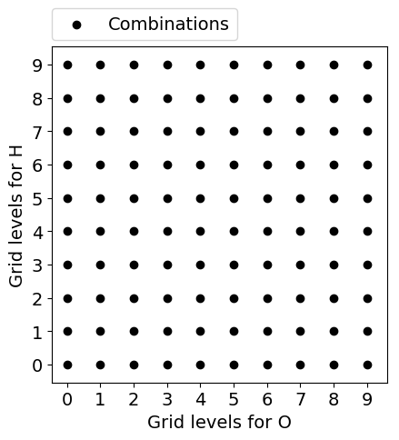
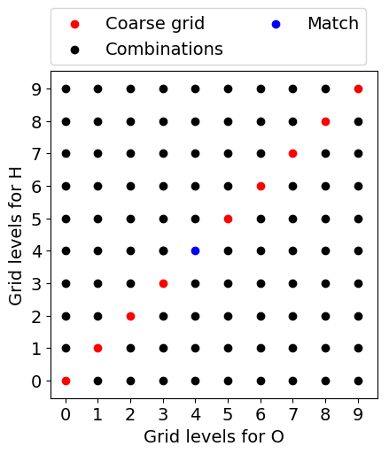
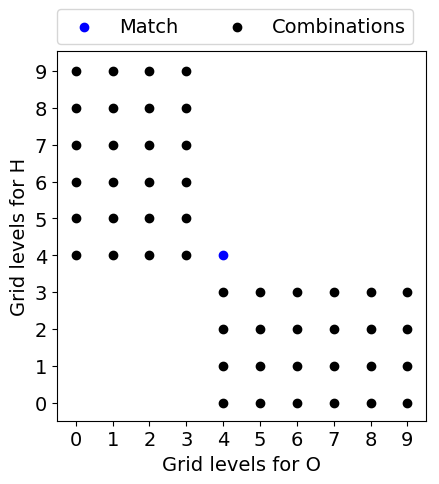
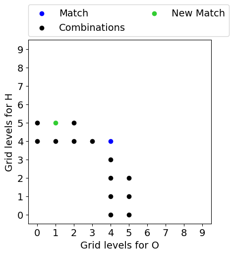
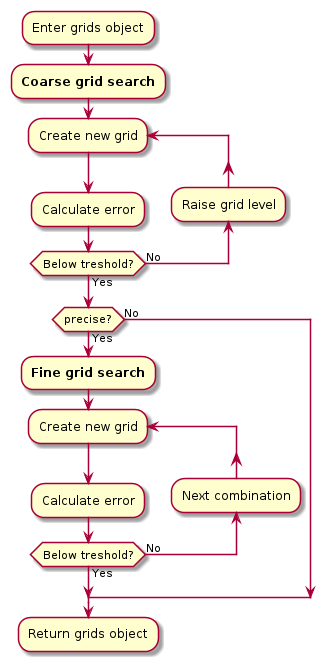

.. _introduction:

Introduction
************

What is this?
=============

A variational mesh algorithm can be defined as a quadrature mesh generation technique that depends on a variational parameter that regulates the accuracy. This package contains one implementation that can be used to optimize meshes for quantum chemistry calculations with `PySCF <https://github.com/pyscf/pyscf>`_ and/or `PyFLOSIC <https://github.com/pyflosic/pyflosic>`_.

How it works
============

We know, that the electronic density :math:`n(\boldsymbol r)` integrates to the number of electrons :math:`N` of our system.

.. math::

   N = \int n(\boldsymbol r)\,\mathrm{d}^{3} \boldsymbol r

A good representation of this density with a given quadrature mesh is necessary for accurate density functional theory (DFT) calculations. Sadly, we do not have the true electronic density :math:`n(\boldsymbol r)` at the beginning of our calculation. Instead, we can use the initial-guess density :math:`n_{\mathrm{init}}(\boldsymbol r)` that integrates to a value of :math:`N_{\mathrm{init}}`. The representation of this density will be optimized by minimizing the error :math:`\epsilon` for a given threshold.

.. math::

   \epsilon = \frac{|N - N_{\mathrm{calc}}|}{N}

This threshold will be the variational parameter of this implementation.

Minimization algorithm
----------------------

The default setting for the variational mesh function is strictly bound to PySCF's grid levels (0-9) that are just lists of ten radial and angular grids for every group of elements. To show how the algorithm works, a molecule with two atomic species will be used (H\ :sub:`2`\ O). Assuming that more grid points mean a better representation of the density (for an atomic species) and therefore results in a smaller error, we use this knowledge to generate more accurate grids. Our optimal grid for a specific threshold would be somewhere in the combination space shown in the figure below.

First, we will do a coarse grid search (seen in the figure below, colored in red) where the grid levels for every atomic species are the same, starting at grid level 0. Eventually, we find a match (colored in blue), i.e., a combination whose error is below our threshold. If there is no match the best possible grid will be used.

With the found match we can eliminate further grid level pairs, shown below. It is safe to remove the upper right regime, since raising either one of the grid levels will only result in a larger grid than the found one. We can also remove the bottom left part. With no match in the previous steps of the coarse grid search, it is unlikely to find a smaller grid below the threshold while reducing grid levels.

At last, we can remove every combination that would have a larger number of grid points than our match since we are only interested in the minimal amount of grid points. For H\ :sub:`2`\ O this step can be seen, again, in the figure below. Afterward, we go through the list of possible candidates sorted by growing numbers of grid points and calculate the resulting error until we eventually get a new match (colored in green). This will be referred to as the fine grid search.

Program flow
------------

The program-flow can be visualized with the following activity diagram.

How to cite
===========

The project has been published with Zenodo and has an assigned DOI that can be found `here <https://zenodo.org/record/4298752>`_.

BibTeX key::

   @Misc{Schulze2020,
     author    = {Wanja Schulze and Sebastian Schwalbe and Kai Trepte and Jakob Kraus and Simon Liebing and Jens Kortus},
     title     = {wangenau/variational_mesh: v1.0.0},
     year      = {2020},
     month     = nov,
     doi       = {10.5281/zenodo.4298752},
     publisher = {Zenodo},
   }
