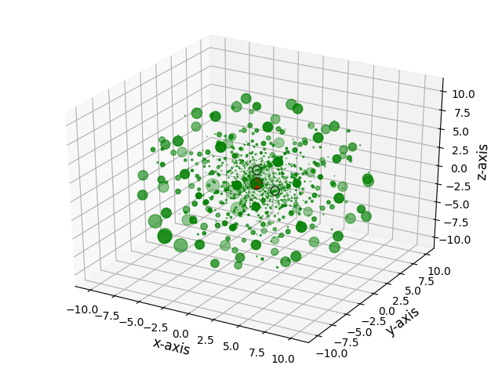
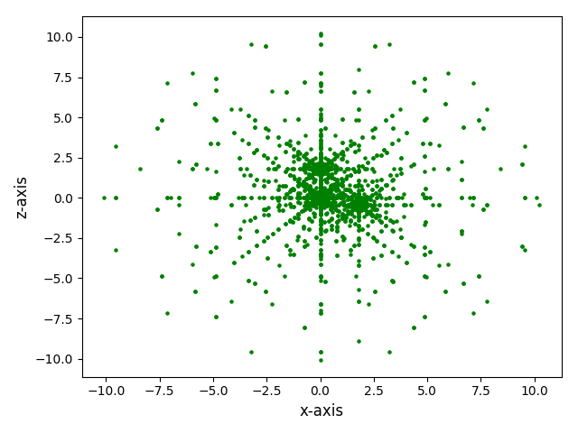
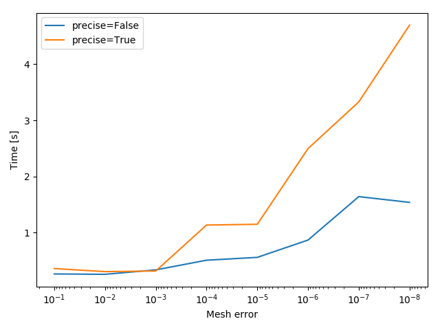
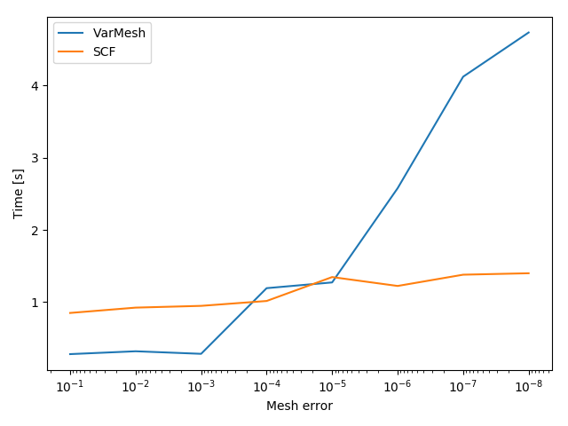

.. _tutorial:

Tutorial
********

| This tutorial shows the usage of the :mod:`var_mesh` package. The code snippets can be executed in a Python shell when going from top to bottom. When looking at specific examples, some previous inputs may be necessary to run them. To run the example separately, the script can be found at the bottom of the section.
| The prerequisite for this tutorial is a successful :ref:`installation<installation>` of the package. Test the installation with the following command in your Python shell.

.. code-block:: python

   >>> import var_mesh

Minimal example
===============

With the goal in mind to optimize meshes for further DFT calculations, a simple example calculation for water can be done. For this, the necessary :mod:`pyscf` and :mod:`var_mesh` modules need to be imported.

.. code-block:: python

   >>> from pyscf import dft, gto
   >>> from var_mesh import var_mesh

Next, the water :mod:`mol` object can be created, along with the :mod:`RKS` object for the restricted Kohn-Sham SCF calculation.

.. code-block:: python

   >>> mol = gto.M(atom='O 0 0 0; H 0 0 0.95691; H 0.95691 0 -0.23987')
   >>> mf = dft.RKS(mol)

Calling the function :func:`var_mesh` and overwriting the existing :class:`Grids` object will create the optimized mesh for the calculation, which can be started afterwards.

.. code-block:: python

   >>> mf.grids = var_mesh(mf.grids)
   Atom grids = {'H': (30, 110), 'O': (60, 302)}
   >>> mf.kernel()
   converged SCF energy = -74.7350158141935

The output from :func:`var_mesh` can be reused for future calculations.

.. code-block:: python

   >>> mf.grids.atom_grid = {'H': (30, 110), 'O': (60, 302)}
   >>> mf.kernel()
   converged SCF energy = -74.7350158141935

The script for this example can be downloaded :download:`here </../examples/01_minimal_example/01_minimal_example.py>`.

Custom grids
============

Instead of default PySCF grid levels, custom radial or angular grids can be used as well. For this, the parameters ``rad`` or ``ang`` can be overwritten with dictionaries that have the atom type identifiers as keys, with lists of the respective number of grids as values.

.. code-block:: python

   >>> from var_mesh import gen_mesh
   >>> gen_mesh.rad = {'H': list(range(10, 100, 15)), 'O': list(range(20, 200, 20))}
   >>> print(gen_mesh.rad)
   {'H': [10, 25, 40, 55, 70, 85], 'O': [20, 40, 60, 80, 100, 120, 140, 160, 180]}

The angular grids have to follow the Lebedev order. The array ``ang_grids`` can be used for this purpose and contains all possible grid numbers.

.. code-block:: python

   >>> gen_mesh.ang = {'H': gen_mesh.ang_grids[15:20], 'O': gen_mesh.ang_grids[20:25]}
   >>> print(gen_mesh.ang)
   {'H': array([350, 434, 590, 770, 974]), 'O': array([1202, 1454, 1730, 2030, 2354])}

Different attributes of the :class:`Grids` class can also freely be used and will be respected in the optimizations. See the `documentation  <https://sunqm.github.io/pyscf/modules/dft.html#pyscf.dft.gen_grid.Grids>`_ for more details.

.. code-block:: python

   >>> mesh = dft.Grids(mol)
   >>> mesh.prune = None

Changing the attribute ``verbose`` will change the amount of output of the :func:`var_mesh` function, with the maximum output at level ``5``. The error threshold can be changed as well.

.. code-block:: python

   >>> mesh.verbose = 5
   >>> mesh = var_mesh(mesh, thres=1e-7)
   Start coarse grid search.
   [1/5] Error = 5.79931e-04
   [2/5] Error = 1.44722e-07
   [3/5] Error = 2.00122e-08
   Error condition met.
   Level = 2
   Start fine grid search.
   [1/6] Error = 3.13417e-05
   [2/6] Error = 1.49391e-08
   Error condition met.
   Levels per atom type:
   'H' = 2
   'O' = 1
   Atom grids = {'H': (40, 590), 'O': (40, 1454)}
   >>> print('Mesh points = %d' % len(mesh.coords))
   Mesh points = 105360

One can see that only five combinations in the coarse grid search will be tested. Because the custom angular grid levels for hydrogen has the shortest list of grid numbers, only the first five elements will be used for every other atomic species.

The script for this example can be downloaded :download:`here </../examples/02_custom_grids/02_custom_grids.py>`.

Helper functions
================

The package comes with functions to visualize meshes. The function :func:`plot_mesh_3d` will open an interactive 3d plot with grid points colored in green, and the atoms colored in their respective `CPK color <https://en.wikipedia.org/wiki/CPK_coloring>`_. The grid points can be scaled by their respective weights.

.. code-block:: python

   >>> from var_mesh import plot_mesh_3d
   >>> mesh = dft.Grids(mol)
   >>> mesh.level = 0
   >>> mesh.build()
   >>> plot_mesh_3d(mesh=mesh, weight=True)

The grid can be projected to a given plane, and the grid points can be scaled by a given integer.

.. code-block:: python

   >>> from var_mesh import plot_mesh_2d
   >>> plot_mesh_2d(mesh=mesh, weight=5, plane='xz')

The script for this example can be downloaded :download:`here </../examples/03_helper_functions/03_helper_functions.py>`.

Precise option
==============

The fine grid search is enabled by default but can be disabled with the parameter ``precise``. Disabling this option will result in a faster grid generation process, but the resulting grid may be larger.

.. code-block:: python

   >>> from timeit import default_timer
   >>> start = default_timer()
   ... mesh = var_mesh(mf.grids, thres=1e-8, precise=False)
   ... end = default_timer()
   ... print('Time spent = %f seconds' % (end - start))
   ... print('Mesh points = %d' % len(mesh.coords))
   Atom grids = {'H': (60, 434), 'O': (90, 590)}
   Time spent = 1.228876 seconds
   Mesh points = 60828

This can be compared to the output when the parameter ``precise`` is set to ``True``

.. code-block:: python

   >>> start = default_timer()
   ... mesh = var_mesh(mf.grids, thres=1e-8, precise=True)
   ... end = default_timer()
   ... print('Time spent = %f seconds' % (end - start))
   ... print('Mesh points = %d' % len(mesh.coords))
   Atom grids = {'H': (50, 302), 'O': (90, 590)}
   Time spent = 3.657851 seconds
   Mesh points = 48500

The script for this example can be downloaded :download:`here </../examples/04_precise_option/04_precise_option.py>`.

Mesh time
=========

A more sophisticated way to show the time difference would be to time both options for a set of different thresholds.

.. code-block:: python

   >>> import numpy as np
   >>> errors = 10.0**(np.arange(-1, -9, -1))
   >>> print(errors)
   [1.e-01 1.e-02 1.e-03 1.e-04 1.e-05 1.e-06 1.e-07 1.e-08]

A code to time the different options can look like the following

.. code-block:: python

   >>> times_false = []
   >>> times_true = []
   >>> for i in range(len(errors)): \
   ...     t1 = default_timer() \
   ...     mesh = var_mesh(mesh, thres=errors[i], precise=False) \
   ...     t2 = default_timer() \
   ...     mesh = var_mesh(mesh, thres=errors[i], precise=True) \
   ...     t3 = default_timer() \
   ...     times_false.append(t2 - t1) \
   ...     times_true.append(t3 - t2)

These result can be plotted afterwards.

.. code-block:: python

   >>> import matplotlib.pyplot as plt
   >>> plt.plot(errors, times_false, label='precise=False')
   >>> plt.plot(errors, times_true, label='precise=True')
   >>> plt.xlabel('Mesh error')
   >>> plt.ylabel('Time [s]')
   >>> plt.xscale('log')
   >>> plt.gca().invert_xaxis()
   >>> plt.legend()
   >>> plt.show()

The script for this example can be downloaded :download:`here </../examples/05_mesh_time/05_mesh_time.py>`.

Calculation time
================

Another interesting aspect might be the grid generation time in relation to the DFT calculation time.

.. code-block:: python

   >>> mf = dft.RKS(mol)
   >>> mf.verbose = 0
   >>> mf.grids.verbose = 0
   >>> time_mesh = []
   >>> time_scf = []
   >>> for i in range(len(errors)): \
   ...     t1 = default_timer() \
   ...     mf.grids = var_mesh(mf.grids, thres=errors[i], precise=True) \
   ...     t2 = default_timer() \
   ...     mf.kernel() \
   ...     t3 = default_timer() \
   ...     time_mesh.append(t2 - t1) \
   ...     time_scf.append(t3 - t2)

These result can be plotted as well.

.. code-block:: python

  >>> plt.plot(errors, time_mesh, label='VarMesh')
  >>> plt.plot(errors, time_scf, label='SCF')
  >>> plt.xlabel('Mesh error')
  >>> plt.ylabel('Time [s]')
  >>> plt.xscale('log')
  >>> plt.gca().invert_xaxis()
  >>> plt.legend()
  >>> plt.show()

The script for this example can be downloaded :download:`here </../examples/06_calculation_time/06_calculation_time.py>`.

PyFLOSIC example
================

This package can be used with the :mod:`pyflosic` package, too. Since :mod:`pyflosic` only supports Python 3, this example can not be executed with Python 2. The package :mod:`ase` is required as well.

.. code-block:: python

   >>> from ase.io import read
   >>> from flosic_os import ase2pyscf, xyz_to_nuclei_fod
   >>> from flosic_scf import FLOSIC

| At first, a geometry file is needed: :download:`H2.xyz </../examples/07_pyflosic_usage/H2.xyz>`
| Next, the calculation details have to be set up.

.. code-block:: python

   >>> molecule = read('H2.xyz')
   >>> geo, nuclei, fod1, fod2, included = xyz_to_nuclei_fod(molecule)
   >>> mol = gto.M(atom=ase2pyscf(nuclei), basis='6-311++Gss', spin=0, charge=0)
   >>> sic_object = FLOSIC(mol, xc='lda,pw', fod1=fod1, fod2=fod2, ham_sic='HOO')
   >>> sic_object.max_cycle = 300
   >>> sic_object.conv_tol = 1e-7

By default a grid level of ``3`` will be used. Here we compare the mesh size before and after the optimization.

.. code-block:: python

   >>> mesh_size = len(sic_object.calc_uks.grids.coords)
   >>> print('Mesh size before: %d' % mesh_size)
   Mesh size before: 28186
   >>> sic_object.calc_uks.grids = var_mesh(sic_object.calc_uks.grids)
   >>> print('Mesh size after: %d' % len(sic_object.calc_uks.grids.coords))
   Mesh size after: 6600

Finally, start the FLO-SIC calculation.

.. code-block:: python

   >>> sic_object.kernel()
   ESIC = -0.045866
   ESIC = -0.045129
   ESIC = -0.045133
   ESIC = -0.045130
   ESIC = -0.045129
   ESIC = -0.045129
   ESIC = -0.045129
   ESIC = -0.045129
   ESIC = -0.045129
   ESIC = -0.045129
   ESIC = -0.045129
   ESIC = -0.045129
   ESIC = -0.045129
   converged SCF energy = -1.18118690828491  <S^2> = 6.6613381e-16  2S+1 = 1

The script for this example can be downloaded :download:`here </../examples/07_pyflosic_usage/07_pyflosic_usage.py>`.
